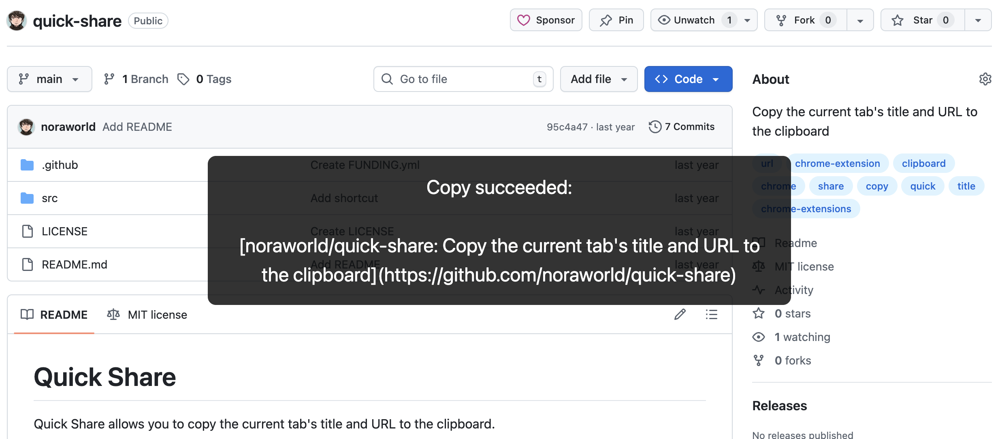
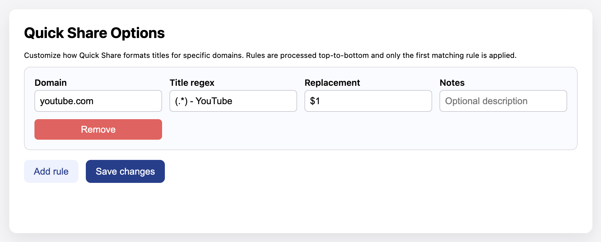

# Quick Share
Quick Share allows you to copy the current tab's title and URL to the clipboard.

## Installation
* [Chrome Web Store](https://chromewebstore.google.com/detail/kjhcidanhganlbknaalgaiahmjjialeb/preview)
* [Firefox Browser Add-ons](https://addons.mozilla.org/en-US/firefox/addon/quick-share/)

## Usage
- Trigger Quick Share with the default shortcut `Ctrl+Shift+A` (`MacCtrl+Ctrl+A` on macOS) or by clicking the toolbar icon.
- The extension copies a Markdown link for the active tab in the format `[Page Title](https://example.com/path)` to your clipboard.
- A small toast is injected into the page to confirm success (green) or failure (red). If the toast is disabled by site policies, check the browser console for errors.
- Title rewrites are optional: open the options page to enter domain-specific regex rules if you want to trim or reshape titles before they are copied.

## Technical notes
The extension now ships a single Manifest V3 configuration (`src/manifest.json`) that works across Chrome and Firefox. The background definition provides both a service worker (used by Chromium-based browsers) and a traditional background script fallback for Firefox, where MV3 service workers remain disabled. The runtime logic relies on `chrome.scripting.executeScript` when the API exists (Chrome/Edge) and automatically falls back to `tabs.executeScript` for browsers that are still catching up (Firefox). This keeps the code path unified while continuing to support the keyboard shortcut workflow defined in the `commands` section.

### Title customization
Open the extension options page to add domain-specific rules that rewrite page titles before Quick Share formats the Markdown link. Each rule defines:

- **Domain**: Exact hostname (supports wildcards such as `*.github.com`).
- **Title regex**: Regular expression that is tested against the document title.
- **Replacement**: Replacement string applied when the regex matches (defaults to `$&`).
- **Notes** *(optional)*: Free-form text to remind you what the rule is for.

Rules are evaluated from top to bottom, and the first match wins.

#### Examples
| Domain             | Title regex                                 | Replacement | Notes                                       |
| ------------------ | ------------------------------------------- | ----------- | ------------------------------------------- |
| `github.com`       | `(.*) · Issue #\d+ · .*/.*`                 | `$1`        | Keep only the issue title on issue pages.   |
| `*.youtube.com`    | `(.*) - YouTube`                            | `$1`        | Drop the "- YouTube" suffix from videos.    |
| `dev.to`           | `(.*) - DEV Community`                      | `$1`        | Use article titles without the site name.   |
| `jira.example.com` | `(\w+-\d+) · (.*)`                          | `$2 [$1]`   | Move Jira issue key to the end in brackets. |

## Privacy
Quick Share never phones home: all logic runs locally and the only data we touch is the current tab's title/URL (and any optional rewrite rules you configure). If you still want the legal fine print, the full policy is a short read: [Privacy Policy for Quick Share](https://www.freeprivacypolicy.com/live/6531850d-0d0b-4fdc-b8b0-59f77de5b894).
